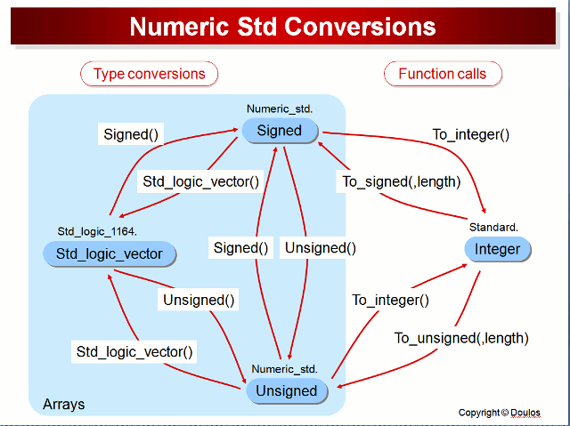

# Learning_VHDL_LANGUAGE

   - INTEL
        [INTEL_VHDL](https://www.bing.com/videos/riverview/relatedvideo?&q=basic+of+vhdl+intel&&mid=0560627AA878FB5007350560627AA878FB500735&&FORM=VRDGAR)
 
   - FREE RANGE VHDL
      [FREE_RANGE_VHDL](https://faculty-web.msoe.edu/johnsontimoj/EE3921/files3921/Book_FreeRangeVHDL.pdf)
  
   - Good reference
   [Reference](https://ics.uci.edu/~jmoorkan/vhdlref/)
     
   - Some 
     [Intro](https://www.synthworks.com/papers/vhdl_math_tricks_mapld_2003.pdf)

   - VHDL Conversions
    [VHDL_CONV](https://nandland.com/common-vhdl-conversions/#Numeric-Integer-To-Std_Logic_Vector)

   - [books_Download_VHDL](https://zlib.pub/download/digital-systems-design-using-vhdl-3rd-edition-h5pgsr2n76c0?hash=244430aba10b176079749610cc2aa93b)

   - [Memories_in_VHDL](https://www.eng.auburn.edu/~nelson/courses/elec4200/Slides/VHDL%205%20Memory%20Models.pdf)
 
 

   - [Understanding_VHDL_ATTRIBUTES](http://xilinx.info/_hdl/2/_ref/acc-eda/language_overview/objects__data_types_and_operators/understanding_vhdl_attributes.htm#:~:text=%E2%80%98Succ%20%28value%29%20Example%3A%20V%3A%20state_type%20%3A%3D%20state_type%20%28Idle%29%3B,%28Read%29%3B%20--%20V%20has%20the%20value%20of%20Idle)

   - VHDL ---    VHSIC HDL ---- VERY HIGH SPEED INTEGRATED CIRCUIT HARDWARE DESCRIPTION LANGUAGE

   - It's used to decribe digital logic design , especially mostly used for creating RTL Design 

   
## What is an RTL Design ?

-  RTL design ----Register Transfer level

-  it is an abstraction of computer design , where piece of hardware (digital logic) is used to 
   depict the building blocks of electronic (binary 1's and 0's) system , it comprises of various control path (`FSM `) and data path sub blocks 
   which are further categorized in `MUX` , `DEMUX`  , `DECODERS` , `Flip flops` ,
   complex state machines for controlling the flow of data 

## Background of VHDL 

- VHDL was firstly used in U.S department of defense in early 1980's to design digital electronics circuits ,
   and mainly for FPGA (Field Programmable Gate Arrays).

- it includes constructs not typically found in traditional
  programming languages, such as signals, concurrency, and time.
  However, not all of VHDL’s language features are useful for synthesizing digital
  systems, and not all of its useful synthesis features need to be understood before
  simple systems can be designed.

- Language constructs and their syntax and semantics
  are introduced in this book as they are needed.

## Generate statements in VHDL

- In `VHDL` Generate statements has numerous usecases.
- For e.g-: let's say we use `generic` keyword in VHDL

      - Generic ( SYNC_STATGE := 2);
      - HAS_SYNC_STAGES : if SYNC_STAGES = 1 generate

      begin
         SYNC_REG[0] <= I_din ;
         SYNC_REG[1] <= SYNC_REG[0];
      end generate HAS_SYNC_STAGES;
     
      - HAS_NO_SYNC_STAGES : if SYNC_STAGES = 0 generate

          begin
          out_reg <= i_din ;
          end generate HAS_NO_SYNC_STAGES ;

 ## using PACKAGE IN VHDL 

## SIGNALS Vs Variable

## Some Important keywords in VHDL

  - `Task to be done -: `
  - `MAKE A Configurable ASYNCHRONOUS_FIFO in VHDL`
  - `DO its timing analysis`
 
  - [UART](https://github.com/alialaei110/HDLab-FPGA-Development-Board/blob/master/Example-Projects/VHDL_Module/UART/UART.vhd)
  - Do its simulation
  - Then implement your own 
  - Chekc compiler directives `if_def` in `Digital System Design using Verilog by Charles Roth`
  - Check Functions and Task in above book
  - Check Fixed and floating point arithmetic topic (search , learn from videos)
  - Implement fixed point adder and floating point adder
  - ple
